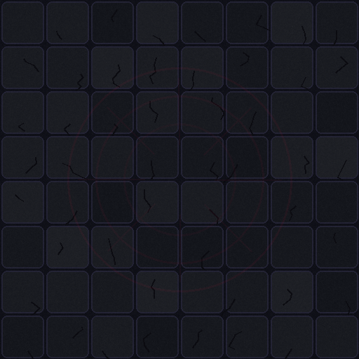

# 《深紅倖存者 Crimson Survivor》使用者手冊

> 適用版本：**R31 PHASED GENERIC BOSS SUMMONS**  
> 文件定位：玩家操作與系統說明。本文不提供武器 Build、Boss 打法或通關攻略。

<p align="center">
  
  &nbsp;&nbsp;&nbsp;
  
</p>

---

## 1. 遊戲概要

《深紅倖存者》是一款 Survivor-like 自動攻擊生存遊戲。玩家負責移動、選擇升級與管理本局能力；武器會自動尋找敵人並發動攻擊。

一局遊戲分成兩個主要階段：

```text
開場 → 生存與升級 → 15:00 深淵暴君降臨 → 3 分鐘 Boss 戰 → 戰利品拾取 → 結算
```

- **生存階段：** 持續 15 分鐘，敵人種類、數量與強度會逐步增加。
- **Boss 階段：** 15:00 後出現深淵暴君，必須在 3 分鐘限制內完成討伐。
- **勝利拾取：** Boss 死亡後會噴發 200 顆 EXP 晶體，玩家有 15 秒自由拾取時間。
- **失敗條件：** HP 歸零，或 Boss 戰 3 分鐘倒數結束。

---

## 2. 基本操作

| 操作 | 鍵盤／滑鼠 | 觸控裝置 |
|---|---|---|
| 移動角色 | `WASD`、方向鍵，或滑鼠指向移動 | 左下虛擬搖桿 |
| 暫停／繼續 | `ESC` | 點擊右上暫停按鈕 |
| 選擇升級 | 點擊卡片，或按 `1`、`2`、`3` | 點擊卡片 |
| 攻擊 | 全自動 | 全自動 |

角色會朝移動方向或目標方向轉向，但玩家不需要手動按攻擊鍵。

---

## 3. 遊戲畫面

<p align="center"></p>

- **畫面上方中央：** 生存時間；進入 Boss 戰後改為 Boss 戰鬥倒數。
- **右上方：** 目前分數、等級與擊殺數。
- **左下方：** HP 與 EXP 進度。
- **右下方：** 目前持有的武器與等級，正常上限為 6 種特殊武器。
- **上方狀態列：** 雙倍 EXP、護盾、冰凍、過載等暫時效果。
- **暫停畫面：** 可檢視完整武器與本局永久能力清單。

### EXP 與升級


擊敗敵人會掉落 EXP 晶體。晶體進入拾取範圍後會向角色移動；EXP 滿足升級需求時，遊戲暫停並出現三選一升級畫面。選項可能是：

- 新武器或既有武器升級。
- 本局永久能力。
- 立即生效的道具。

<br clear="left">

---

## 4. 武器系統

玩家固定擁有自動射擊的**基礎針彈**，並可在本局中取得最多 6 種特殊武器。每種特殊武器最高 Lv.5；各等級通常會改變傷害、數量、範圍、冷卻或追加特殊效果。

| 圖示 | 武器 | 初始特性 | Lv.5 主要變化 |
|---|---|---|---|
|  | **爆裂霰彈** | 5 顆扇形彈丸，每顆造成 9 傷害。 | 加入穿透核心彈，命中後爆裂。 |
|  | **迴旋斬輪** | 投出斬輪，去程與回程皆可命中。 | 回到玩家時釋放圓盤斬。 |
|  | **衛星刃環** | 2 枚大型刃片環繞玩家。 | 6 枚超大型刃片，週期外擴且尺寸同步成長。 |
|  | **燼火噴流** | 向敵群噴射火焰，每 0.2 秒造成傷害。 | 同時向前後噴射，燃燒效果提高。 |
|  | **雷弧鏈** | 雷電在 4 名敵人之間跳躍。 | 同時產生 2 條起始雷弧。 |
|  | **寒霜脈衝** | 釋放較大範圍的寒霜脈衝並緩速敵人。 | 先凍結敵人，死亡時可能碎裂。 |
|  | **天墜隕石** | 在敵人密集處降下一顆隕石，落地後留下燃燒區。 | 降下 3 顆，最後一顆為大型隕石。 |
|  | **腐蝕地雷** | 在腳下布置地雷與腐蝕池。 | 地雷可連鎖引爆並緩速。 |
|  | **貫星光束** | 發射長直線全穿透光束。 | 同時向前後發射並追加傷害。 |
|  | **震地戰鎚** | 近身重擊並強力擊退，基礎傷害提高。 | 追加第二道高傷害大型外環。 |
|  | **獵殺無人機** | 1 架無人機自動射擊。 | 3 架無人機，週期發射飛彈。 |
|  | **重力奇點** | 從玩家位置投射重力核心，抵達後展開奇點。 | 同時向不同敵群投射 2 枚重力核心。 |

---

## 5. 本局永久能力

> 這裡的「永久」代表**取得後在本局持續生效**；重新開始遊戲後會重置。

| 圖示 | 能力 | 效果 |
|---|---|---|
|  | **生命強化** | 最大 HP +15，並回復 15 HP。 |
|  | **步伐強化** | 提高移動速度。第 5 級達基礎速度 2.5 倍。 |
|  | **磁力強化** | 擴大 EXP 與拾取物吸引範圍。 |
|  | **嗜血轉化** | 敵人受到的傷害有 0.03% 轉為 HP；不足 1 HP 的部分會持續累積。每級再 +0.03%，Lv.5 共 0.15%。 |
|  | **道具脈衝** | 地圖道具出現冷卻 -5%。 每級再 -5%。 |
|  | **戰術超頻** | 所有武器冷卻 -4%，包含基礎針彈與無人機。 每級再 -4%。 |
|  | **廣域增幅** | 所有武器射程或效果半徑 +6%。 每級再 +6%。 |
|  | **實體增幅** | 武器視覺與判定都會放大 +6%。 每級再 +6%。 |
|  | **自癒強化** | 每隔一段時間恢復 HP。 Lv.1～Lv.5  每次分別回復 1~3 HP  間隔為 5~3 秒。 |
|  | **瞄準器** | 原地不動 3 秒後進入瞄準狀態並增加傷害；一旦移動就解除。 每級再 +15%。 |
|  | **動態感知** | 連續跑步 2 秒後會週期性獲得 EXP。 Lv.1 為每 2 秒 +1~3 EXP，之後每級再縮短 0.2 秒。 |
|  | **無損狂熱** | 滿血狀態時，所有武器冷卻縮短。 每級再 -7%。 |

---

## 6. 即時道具

道具可能在升級三選一中出現，也可能生成於地圖。地圖道具有存在時間，角色靠近後會自動吸附並拾取。

| 圖示 | 道具 | 效果 |
|---|---|---|
|  | **血液補劑** | 立即回復 25 HP。 |
|  | **再生注射** | 10 秒內持續回復生命。 |
|  | **光盾電池** | 5 秒內完全無敵。 |
|  | **全域磁極** | 將地圖上全部 EXP 吸向玩家。 |
|  | **停滯鐘** | 所有敵人停止動作 6 秒。 |
|  | **雙倍知識** | 20 秒內取得 EXP ×2。 |
|  | **過載核心** | 12 秒內所有武器冷卻縮短 40%。 |
|  | **清場炸彈** | 重創場上所有敵人。 |
|  | **驅散衝擊** | 擊退畫面內敵人並暈眩。 |

---

## 7. 敵人圖鑑

敵人會依照遊戲時間逐步加入戰場。表中的 HP 與 EXP 是設定檔中的基礎值；實際敵人會隨時間套用成長倍率。

| 圖示 | 敵人 | 定位 | 最早登場 | 基礎 HP | EXP |
|---|---|---|---:|---:|---:|
|  | **鼠群** | 大量弱怪 | 開場 | 15 | 1 |
|  | **血獵犬** | 快速怪 | 1:45 | 50 | 5 |
|  | **鐵殼守衛** | 厚甲怪 | 2:35 | 500 | 20 |
|  | **瘟疫噴吐者** | 遠程怪 | 3:35 | 250 | 30 |
|  | **膨脹自爆體** | 自爆壓力怪 | 4:50 | 400 | 35 |
|  | **虛影獵手** | 突進控制怪 | 6:35 | 400 | 40 |
|  | **深岩巨像** | 高HP重型怪 | 8:35 | 2500 | 120 |
|  | **深淵暴君** | 終局Boss | 15:00 | 20000 | 1000 |

### 特殊行為概覽

- **血獵犬：** 高速接近並持續追蹤玩家。
- **鐵殼守衛：** 速度較慢、生命值較高。
- **瘟疫噴吐者：** 保持距離並發射遠程攻擊。
- **膨脹自爆體：** 靠近玩家後蓄力爆炸。
- **虛影獵手：** 會預警並高速突進。
- **深岩巨像：** 高 HP、移動緩慢，對控制與擊退較有抗性。

---

## 8. 深淵暴君 Boss 戰

<p align="center"></p>

深淵暴君於 **15:00** 降臨，Boss 戰限時 **180 秒**。Boss 會使用三類主要攻擊：

- **扇形彈幕：** 向玩家方向發射多枚擴散彈。
- **長槍連射：** 預警後連續發射高速彈，後期發射數量增加。
- **環形彈幕：** 蓄力後向四周釋放環狀彈幕。

Boss 的攻擊強度會在 HP 降至 75%、50%、25% 後提升，並於多個血量門檻招喚一般敵人。

### 最後的波紋

若玩家在 Boss 戰死亡，而且本局尚未使用過「最後的波紋」，遊戲會詢問是否消耗 **1,000 分**復活：

- 以 100% 最大 HP 復活。
- 只能使用一次。
- 決死時間 10 秒。
- 傷害 ×1.5。
- 移動速度 ×1.25。
- 前 3 秒無敵。
- 武器冷卻縮短 30%。
- 10 秒內擊敗 Boss，死亡限制解除；否則角色立即死亡。
- Boss 不會因玩家復活而回復 HP。

### Boss 戰利品

Boss 死亡後，會從死亡位置以拋物線噴發：

- **600 顆 EXP 晶體**。
- 每顆 **5 EXP**，合計 **3000 EXP**。
- 約在 5 秒內完成噴發與落地。
- 前 2 秒不能拾取。
- 總拾取時間為 15 秒，這段時間不計入 Boss 戰耗時與成績時間。

---

## 9. 分數與結算

目前總分主要由以下部分組成：

```text
總分 ＝ 等級 × 100 -100
     ＋ 擊敗 Boss 時的剩餘完整秒數 × 30
     ＋ 本局額外分數調整
```

- Lv.1 的基礎等級分為 0。
- 越高等級會帶來越高的等級分數。
- 成功擊敗 Boss 時，Boss 戰剩餘時間會轉換成分數。
- 使用「最後的波紋」會扣除 1,000 分。
- 結算畫面顯示總分、存活時間、等級、擊殺數與武器數量。

### 線上排行榜

勝利後可輸入玩家名稱並提交成績。排行榜顯示 Top 50，欄位包含：

- 排名
- 分數
- 玩家名稱
- 擊殺數
- Boss 剩餘時間
- 等級

成績提交需要網路連線；未擊敗 Boss 的局數不會開放提交。

---

## 10. 暫停

一般玩家可透過暫停畫面檢視本局配置。

---

# 深入研究

<details>
<summary><strong>查看 12 種武器的 Lv.1～Lv.5 文字變化</strong></summary>


###  爆裂霰彈

- **Lv.1：**5 顆扇形彈丸，每顆造成 9 傷害。
- **Lv.2：**彈丸增加為 7 顆，扇形擴大。
- **Lv.3：**每顆傷害提高並增加擊退。
- **Lv.4：**冷卻縮短、射程提高。
- **Lv.5：**加入穿透核心彈，命中後爆裂。

###  迴旋斬輪

- **Lv.1：**投出斬輪，去程與回程皆可命中。
- **Lv.2：**傷害與尺寸提高。
- **Lv.3：**同時投出 2 枚斬輪。
- **Lv.4：**冷卻縮短、尺寸提高。
- **Lv.5：**回到玩家時釋放圓盤斬。

###  衛星刃環

- **Lv.1：**2 枚大型刃片環繞玩家。
- **Lv.2：**3 枚刃片，尺寸與命中範圍提高。
- **Lv.3：**4 枚大型刃片，傷害與旋轉速度提高。
- **Lv.4：**5 枚巨刃，擴大軌道並附帶擊退。
- **Lv.5：**6 枚超大型刃片，週期外擴且尺寸同步成長。

###  燼火噴流

- **Lv.1：**向敵群噴射火焰，每 0.2 秒造成傷害。
- **Lv.2：**持續時間與噴射角度提高。
- **Lv.3：**直接傷害提高並附加持續燃燒。
- **Lv.4：**冷卻縮短、射程提高。
- **Lv.5：**同時向前後噴射，燃燒效果提高。

###  雷弧鏈

- **Lv.1：**雷電在 4 名敵人之間跳躍。
- **Lv.2：**增加 2 次跳躍。
- **Lv.3：**傷害提高。
- **Lv.4：**冷卻縮短並微暈眩。
- **Lv.5：**同時產生 2 條起始雷弧。

###  寒霜脈衝

- **Lv.1：**釋放較大範圍的寒霜脈衝並緩速敵人。
- **Lv.2：**脈衝半徑進一步提高。
- **Lv.3：**傷害與緩速效果提高。
- **Lv.4：**冷卻明顯縮短、擊退提高。
- **Lv.5：**先凍結敵人，死亡時可能碎裂。

###  天墜隕石

- **Lv.1：**在敵人密集處降下一顆隕石，落地後留下燃燒區。
- **Lv.2：**爆炸半徑與傷害提高。
- **Lv.3：**每次降下 2 顆隕石。
- **Lv.4：**大幅延長落地燃燒區的持續時間。
- **Lv.5：**降下 3 顆，最後一顆為大型隕石。

###  腐蝕地雷

- **Lv.1：**在腳下布置地雷與腐蝕池。
- **Lv.2：**地雷上限與持續時間提高。
- **Lv.3：**爆炸與腐蝕傷害提高。
- **Lv.4：**冷卻縮短、範圍提高。
- **Lv.5：**地雷可連鎖引爆並緩速。

###  貫星光束

- **Lv.1：**發射長直線全穿透光束。
- **Lv.2：**光束寬度提高。
- **Lv.3：**持續時間與傷害提高。
- **Lv.4：**冷卻縮短並可追蹤轉向。
- **Lv.5：**同時向前後發射並追加傷害。

###  震地戰鎚

- **Lv.1：**近身重擊並強力擊退，基礎傷害提高。
- **Lv.2：**傷害進一步提高。
- **Lv.3：**範圍提高。
- **Lv.4：**冷卻明顯縮短並附加暈眩。
- **Lv.5：**追加第二道高傷害大型外環。

###  獵殺無人機

- **Lv.1：**1 架無人機自動射擊。
- **Lv.2：**無人機增加為 2 架。
- **Lv.3：**傷害提高並穿透。
- **Lv.4：**射擊間隔縮短。
- **Lv.5：**3 架無人機，週期發射飛彈。

###  重力奇點

- **Lv.1：**從玩家位置投射重力核心，抵達後展開奇點。
- **Lv.2：**奇點半徑提高。
- **Lv.3：**持續時間與傷害提高。
- **Lv.4：**冷卻縮短、吸力提高。
- **Lv.5：**同時向不同敵群投射 2 枚重力核心。

</details>

<details>
<summary><strong>查看 Boss 各血量招喚批次</strong></summary>

目前 Boss 招喚內容由 `game-config.json → boss → summon → waves` 驅動。若單次傷害跨越多個門檻，尚未觸發的波次會依序補上。

| 觸發時機 | 招喚內容 |
|---|---|
| Boss 登場 | 鼠群 ×8、血獵犬 ×4 |
| HP ≤ 90% | 鼠群 ×9、血獵犬 ×5 |
| HP ≤ 80% | 鼠群 ×11、血獵犬 ×5、鐵殼守衛 ×1 |
| HP ≤ 70% | 鼠群 ×12、血獵犬 ×6、鐵殼守衛 ×1、瘟疫噴吐者 ×1 |
| HP ≤ 60% | 鼠群 ×13、血獵犬 ×7、鐵殼守衛 ×2、瘟疫噴吐者 ×2、膨脹自爆體 ×1 |
| HP ≤ 50% | 鼠群 ×15、血獵犬 ×7、鐵殼守衛 ×2、瘟疫噴吐者 ×2、膨脹自爆體 ×1、虛影獵手 ×1 |
| HP ≤ 40% | 鼠群 ×16、血獵犬 ×8、鐵殼守衛 ×3、瘟疫噴吐者 ×3、膨脹自爆體 ×2、虛影獵手 ×1 |
| HP ≤ 30% | 鼠群 ×17、血獵犬 ×9、鐵殼守衛 ×3、瘟疫噴吐者 ×3、膨脹自爆體 ×2、虛影獵手 ×2 |
| HP ≤ 20% | 鼠群 ×19、血獵犬 ×9、鐵殼守衛 ×4、瘟疫噴吐者 ×4、膨脹自爆體 ×3、虛影獵手 ×2、深岩巨像 ×1 |
| HP ≤ 10% | 鼠群 ×20、血獵犬 ×10、鐵殼守衛 ×4、瘟疫噴吐者 ×4、膨脹自爆體 ×3、虛影獵手 ×3、深岩巨像 ×1 |

</details>

<details>
<summary><strong>查看核心基礎數據</strong></summary>

| 項目 | 數值 |
|---|---:|
| 玩家初始 HP | 50 |
| 玩家基礎移動速度 | 158 px/s |
| 特殊武器欄位 | 6 |
| 武器／能力最高等級 | Lv.5 |
| 每次升級選項 | 3 選 1 |
| 生存階段 | 15 分鐘 |
| Boss 戰限時 | 180 秒 |
| Boss 基礎 HP | 20000 |
| Boss 擊殺每剩餘 1 秒 | 30 分 |

EXP 升級需求依目前等級套用下式後四捨五入：

```text
需求 EXP ＝ 8 ＋ 2.5 × 等級 ＋ 0.22 × 等級²
```

敵人還會依遊戲時間提升 HP、傷害與速度，因此圖鑑基礎值並不等於後期實際數值。

</details>

---

## 11. 常見問題

### 為什麼武器會自動攻擊？

這是 Survivor-like 類型的核心操作方式。玩家主要控制移動與升級選擇，攻擊目標與施放時機由武器系統自動處理。

### 為什麼重新開始後能力消失？

目前的「永久能力」是本局內永久生效，並不是跨局保存的帳號成長系統。

### 為什麼 Boss 死後不能立刻撿 EXP？

Boss EXP 會先以粒子物理噴發並落地，前三秒為演出與散佈階段，之後才開放拾取。

### 為什麼直接雙擊 HTML 無法開始？

瀏覽器可能阻擋 `file://` 頁面讀取 `game-config.json`。請使用 HTTP Server，或依畫面指示手動選擇設定檔。

### 為什麼排行榜沒有出現？

排行榜需要網路連線，且只有擊敗 Boss 的勝利局才能提交成績。

---

<p align="center">
  <br>
  <strong>進入血月廢墟，建立屬於本局的戰鬥配置。</strong>
</p>
