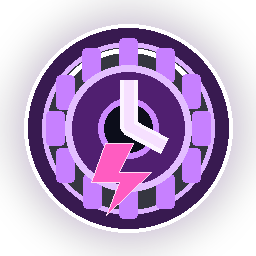

# 《深紅倖存者》玩家說明手冊

> **英文名稱：** CRIMSON SURVIVOR  
> **手冊對應版本：** `R25 HUD PASSIVES + PAUSE LOADOUT`／設定格式 `v9`  
> **建議放置位置：** 與 `index.html`、`game.js`、`game-config.json` 同一層，圖片將由 `assets/...` 相對路徑載入。

<p align="center">
  
  
  
</p>

> **一句話目標：** 在血月廢墟中生存到 **15:00**，接著在 **3 分鐘**內擊敗「深淵暴君」。只撐過十五分鐘還不算勝利。

---

## 目錄

- [1. 快速開始](#1-快速開始)
- [2. 勝利與失敗條件](#2-勝利與失敗條件)
- [3. 操作方式](#3-操作方式)
- [4. 畫面與 HUD](#4-畫面與-hud)
- [5. 戰鬥與成長規則](#5-戰鬥與成長規則)
- [6. 基礎針彈](#6-基礎針彈)
- [7. 十二種武器圖鑑](#7-十二種武器圖鑑)
- [8. 本局永久能力](#8-本局永久能力)
- [9. 地圖道具](#9-地圖道具)
- [10. 敵人圖鑑](#10-敵人圖鑑)
- [11. 十五分鐘戰場時間軸](#11-十五分鐘戰場時間軸)
- [12. 深淵暴君攻略](#12-深淵暴君攻略)
- [13. 計分與線上排行榜](#13-計分與線上排行榜)
- [14. 推薦配裝](#14-推薦配裝)
- [15. 進階生存技巧](#15-進階生存技巧)
- [16. 常見問題](#16-常見問題)
- [17. 數值附錄與版本注意事項](#17-數值附錄與版本注意事項)

---

## 1. 快速開始

1. 按下 **「進入血月廢墟」**開始遊戲。
2. 角色會自動尋找敵人並攻擊；玩家只需要控制移動、走位、拾取 EXP 與選擇升級。
3. 擊殺敵人後拾取 EXP 結晶，累積至需求值即可升級。
4. 每次升級會暫停戰場，從三張卡片中選擇一項武器或本局永久能力。
5. 最多可持有 **6 種額外武器**；每種武器最高 **Lv.5**。基礎針彈不占武器欄。
6. 地圖會定期生成即時道具，接觸後立刻生效。
7. 撐到 **15:00**後 Boss 出現，畫面計時器改為 **3:00 Boss 戰鬥倒數**。

### 新手第一局的簡易原則

- 前期先取得至少一種範圍武器，例如 **衛星刃環、寒霜脈衝、雷弧鏈或震地戰鎚**。
- 不要站在原地等敵人靠近；先維持可撤退的空間，再回頭收集 EXP。
- 武器欄只有六格，取得新武器前先想清楚它在最終配裝中的角色。
- 15:00 前最好具備：至少一種控制、至少一種群體輸出、至少一種能穩定打 Boss 的武器。

---

## 2. 勝利與失敗條件

| 狀態 | 條件 | 結果 |
|---|---|---|
| 生存階段 | 0:00～15:00 | 擊殺敵人、升級、形成配裝 |
| Boss 階段 | 15:00 後 | 深淵暴君登場，限時 3:00 |
| 勝利 | 在 Boss 倒數歸零前擊殺深淵暴君 | 顯示通關結算，可登錄線上成績 |
| 一般失敗 | HP 降至 0，且沒有可用復活 | 本局立即結束 |
| 討伐失敗 | Boss 戰鬥 3 分鐘耗盡，Boss 仍存活 | 本局結束 |

> 「絕境逢生」可在 HP 歸零時自動復活一次，但取得時會消耗 1,000 分。

---

## 3. 操作方式

### 電腦

| 操作 | 按鍵／方式 |
|---|---|
| 移動 | `WASD` 或方向鍵 |
| 滑鼠移動 | 在遊戲畫面按住滑鼠左鍵，角色會朝游標位置移動 |
| 選擇升級 | 數字鍵 `1`、`2`、`3`，或直接點擊卡片 |
| 暫停／繼續 | `Esc` 或右上角暫停按鈕 |
| 重新開始 | 暫停畫面或結算畫面的重新開始按鈕 |
| 音效 | 開始畫面的音效切換按鈕 |

### 手機／平板

- 畫面左下方會顯示虛擬搖桿。
- 拖曳搖桿控制移動；升級時直接點擊卡片。
- 直式螢幕可遊玩，但較建議使用橫向畫面以取得更大的戰場視野。

### 操作上的重要特性

- 攻擊完全自動施放，不需要按攻擊鍵。
- 鍵盤或虛擬搖桿輸入會中止滑鼠自動移動。
- 滑鼠目標很近時，角色會逐漸減速並停下，避免在目標點附近來回抖動。
- 暫停時敵人、投射物、武器冷卻與 Boss 倒數都會停止。

---

## 4. 畫面與 HUD

| 區域 | 顯示內容 | 玩家應注意的事 |
|---|---|---|
| 上方中央 | 生存倒數／Boss 戰鬥倒數 | 15:00 前是養成時間；Boss 階段最多 3 分鐘 |
| 右上方 | 分數、等級、擊殺數 | 分數影響復活購買與結算 |
| 左下方 | HP 與 EXP 條 | EXP 滿後進入升級選擇；HP 歸零即敗北或觸發復活 |
| 右下方 | 武器欄 | 顯示已取得武器與等級，最多 6 格 |
| HUD 永久能力列 | 本局已取得的被動能力 | 圖示與等級會持續顯示 |
| 上方效果列 | 再生、護盾、凍結、雙倍 EXP、過載等計時效果 | 效果結束前可調整打法 |
| 暫停畫面 | 目前武器與永久能力總覽 | 可確認完整配裝與能力說明 |

---

## 5. 戰鬥與成長規則

### 5.1 自動攻擊

- 角色會自動搜尋可攻擊目標並施放基礎針彈與已取得武器。
- 武器通常會鎖定最近敵人或敵群密集區；玩家的核心操作是走位與路線規劃。
- 全域冷卻、範圍、尺寸與傷害增益會依武器類型套用。

### 5.2 EXP 與升級

- 初始等級為 **Lv.1**。
- 一般敵人死亡後會在原地掉落 EXP 結晶；同一小區域大量掉落時，結晶可能合併成較大的結晶。
- Boss 的 2,000 EXP 會在死亡時直接入帳，不需要再回頭拾取。
- 升級需求會隨等級上升，公式見附錄。
- 若一次取得大量 EXP 而連升多級，會依序顯示多次升級選擇。

### 5.3 升級三選一

- 選項由尚未滿級的武器與本局永久能力中隨機抽取。
- 新武器在六格武器欄未滿時才會進入候選池。
- 已取得武器可繼續升級至 Lv.5。
- 一般本局永久能力最高 Lv.5；「絕境逢生」最高 Lv.1。
- 地圖即時道具不會出現在升級卡片中。
- 當所有武器與永久能力都達上限時，後續升級不再顯示卡片。

### 5.4 武器欄與配裝

- 額外武器上限：**6 種**。
- 基礎針彈不占欄位，也不會被替換。
- 遊戲中沒有丟棄武器功能，因此取得新武器等同鎖定一個最終欄位。
- 建議至少配置一種近身保命、一種遠距或全畫面處理、一種控制，以及一種對 Boss 的持續輸出。

---

## 6. 基礎針彈

<p></p>

| 項目 | 數值 |
|---|---:|
| 基礎傷害 | 13 |
| 基礎冷卻 | 0.82 秒 |
| 索敵距離 | 470 |
| 子彈射程 | 550 |
| 子彈速度 | 470 |
| 碰撞半徑 | 10 |

- 基礎針彈會自動攻擊索敵範圍內的最近敵人。
- 從 Lv.2 起，每個等級使基礎傷害增加 2%，最多計算到額外 40 級。
- 「戰術超頻」與「無損狂熱」可縮短冷卻；「廣域增幅」提高索敵與飛行範圍；「實體增幅」放大子彈與判定。

---

## 7. 十二種武器圖鑑

下列數值是武器自身的原始數值；實戰還會受到永久能力、滿血冷卻、過載核心等效果修正。

### 7.1 爆裂霰彈

<p></p>

**定位：** 近中距離爆發／清路  
**操作重點：** 正面扇形輸出強，適合開路與處理逼近敵群；需注意射擊方向與射程。  
**推薦搭配：** 戰術超頻、廣域增幅、實體增幅、瞄準器

| 等級 | 升級效果 | 核心數值 |
|---:|---|---|
| Lv.1 | 5 顆扇形彈丸，每顆造成 9 傷害。 | CD 1.15s；5 發；扇角 55°；每發 9 傷；射程 400；核心彈：無 |
| Lv.2 | 彈丸增加為 7 顆，扇形擴大。 | CD 1.15s；7 發；扇角 65°；每發 9 傷；射程 400；核心彈：無 |
| Lv.3 | 每顆傷害提高並增加擊退。 | CD 1.15s；7 發；扇角 65°；每發 12 傷；射程 400；核心彈：無 |
| Lv.4 | 冷卻縮短、射程提高。 | CD 0.85s；7 發；扇角 65°；每發 12 傷；射程 550；核心彈：無 |
| Lv.5 | 加入穿透核心彈，命中後爆裂。 | CD 0.85s；7 發；扇角 65°；每發 12 傷；射程 550；核心彈 28 傷／爆炸 20 傷 |

> **戰術：** 面向敵群缺口前進，可把扇形彈集中在準備突破的位置。Lv.5 核心彈適合對厚甲怪與 Boss。

### 7.2 迴旋斬輪

<p></p>

**定位：** 往返穿線／移動戰  
**操作重點：** 去程與回程都能造成傷害，繞著敵群移動可讓回程路徑穿過更多目標。  
**推薦搭配：** 步伐強化、廣域增幅、實體增幅、嗜血轉化

| 等級 | 升級效果 | 核心數值 |
|---:|---|---|
| Lv.1 | 投出斬輪，去程與回程皆可命中。 | CD 1.45s；1 枚；傷害 18；尺寸 15；射程 375；回收斬：無 |
| Lv.2 | 傷害與尺寸提高。 | CD 1.45s；1 枚；傷害 22；尺寸 18；射程 375；回收斬：無 |
| Lv.3 | 同時投出 2 枚斬輪。 | CD 1.45s；2 枚；傷害 22；尺寸 18；射程 375；回收斬：無 |
| Lv.4 | 冷卻縮短、尺寸提高。 | CD 1.15s；2 枚；傷害 22；尺寸 21；射程 375；回收斬：無 |
| Lv.5 | 回到玩家時釋放圓盤斬。 | CD 1.15s；2 枚；傷害 22；尺寸 21；射程 375；回收斬 35 傷／半徑 160 |

> **戰術：** 不要只看投出方向。斬輪回到玩家時會再穿過一次敵群，移動路線本身就是瞄準方式。

### 7.3 衛星刃環

<p></p>

**定位：** 貼身防衛／持續輸出  
**操作重點：** 保護玩家周身，適合高密度近戰；搭配範圍、尺寸、吸血與生命強化效果佳。  
**推薦搭配：** 實體增幅、廣域增幅、嗜血轉化、生命強化

| 等級 | 升級效果 | 核心數值 |
|---:|---|---|
| Lv.1 | 2 枚大型刃片環繞玩家。 | 2 刃；軌道 100；刃尺寸 40；判定 18；傷害 12；轉速 2.35 |
| Lv.2 | 3 枚刃片，尺寸與命中範圍提高。 | 3 刃；軌道 115；刃尺寸 43；判定 22；傷害 12；轉速 2.35 |
| Lv.3 | 4 枚大型刃片，傷害與旋轉速度提高。 | 4 刃；軌道 130；刃尺寸 47；判定 27；傷害 18；轉速 3.05 |
| Lv.4 | 5 枚巨刃，擴大軌道並附帶擊退。 | 5 刃；軌道 145；刃尺寸 50；判定 34；傷害 18；轉速 3.05 |
| Lv.5 | 6 枚超大型刃片，週期外擴且尺寸同步成長。 | 6 刃；軌道 160；刃尺寸 60；判定 44；傷害 27；轉速 3.05；每 2.7s 額外外擴 +60／刃尺寸 +15／判定 +14 |

> **戰術：** 刃環不是無敵護盾。面對噴吐者、虛影獵手與 Boss 彈幕仍要走位；Lv.5 外擴週期可瞬間掃掉較外圈敵人。

### 7.4 燼火噴流

<p></p>

**定位：** 扇形持續傷害／燃燒  
**操作重點：** 追蹤敵群並連續灼燒，對高 HP 敵人有效；面對兩側夾擊時 Lv.5 的雙向噴流價值很高。  
**推薦搭配：** 戰術超頻、廣域增幅、嗜血轉化、重力奇點

| 等級 | 升級效果 | 核心數值 |
|---:|---|---|
| Lv.1 | 向敵群噴射火焰，每 0.2 秒造成傷害。 | CD 3.8s；持續 1.5s；射程 286；半角 42°；每 0.2s 8 傷；燃燒 0/s × 0s；方向 1 |
| Lv.2 | 持續時間與噴射角度提高。 | CD 3.8s；持續 1.9s；射程 286；半角 50°；每 0.2s 8 傷；燃燒 0/s × 0s；方向 1 |
| Lv.3 | 直接傷害提高並附加持續燃燒。 | CD 3.8s；持續 1.9s；射程 286；半角 50°；每 0.2s 10 傷；燃燒 5/s × 3.2s；方向 1 |
| Lv.4 | 冷卻縮短、射程提高。 | CD 3s；持續 1.9s；射程 338；半角 50°；每 0.2s 10 傷；燃燒 5/s × 3.2s；方向 1 |
| Lv.5 | 同時向前後噴射，燃燒效果提高。 | CD 3s；持續 1.9s；射程 338；半角 50°；每 0.2s 10 傷；燃燒 9/s × 3.2s；方向 2 |

> **戰術：** 火焰持續轉向追蹤敵群。與重力奇點搭配，可讓燃燒覆蓋大量被聚集的敵人。

### 7.5 雷弧鏈

<p></p>

**定位：** 自動連鎖／密集群清理  
**操作重點：** 不依賴瞄準，可跨敵人跳躍；敵群越密集，實際效率越高。  
**推薦搭配：** 戰術超頻、廣域增幅、重力奇點

| 等級 | 升級效果 | 核心數值 |
|---:|---|---|
| Lv.1 | 雷電在 4 名敵人之間跳躍。 | CD 1.2s；起始雷弧 1；最多命中 4；每次 12 傷；跳躍距離 166；暈眩 0s |
| Lv.2 | 增加 2 次跳躍。 | CD 1.2s；起始雷弧 1；最多命中 6；每次 15 傷；跳躍距離 166；暈眩 0s |
| Lv.3 | 傷害提高。 | CD 1.2s；起始雷弧 1；最多命中 6；每次 23 傷；跳躍距離 166；暈眩 0s |
| Lv.4 | 冷卻縮短並微暈眩。 | CD 0.85s；起始雷弧 1；最多命中 6；每次 23 傷；跳躍距離 166；暈眩 0.15s |
| Lv.5 | 同時產生 2 條起始雷弧。 | CD 0.85s；起始雷弧 2；最多命中 6；每次 23 傷；跳躍距離 166；暈眩 0.15s |

> **戰術：** 敵人過度分散時效率下降。先讓敵群靠攏，或用重力奇點聚怪，再觸發連鎖。

### 7.6 寒霜脈衝

<p></p>

**定位：** 大範圍控制／緩速  
**操作重點：** 傷害之外更重要的是緩速、擊退與 Lv.5 凍結，可替其他武器創造輸出時間。  
**推薦搭配：** 戰術超頻、廣域增幅、實體增幅

| 等級 | 升級效果 | 核心數值 |
|---:|---|---|
| Lv.1 | 釋放較大範圍的寒霜脈衝並緩速敵人。 | CD 2.75s；半徑 175；傷害 28；緩速 40% × 2s；擊退 18；凍結 普通/巨像/Boss=0/0/0s |
| Lv.2 | 脈衝半徑進一步提高。 | CD 2.75s；半徑 220；傷害 28；緩速 40% × 2s；擊退 18；凍結 普通/巨像/Boss=0/0/0s |
| Lv.3 | 傷害與緩速效果提高。 | CD 2.75s；半徑 220；傷害 40；緩速 50% × 3s；擊退 18；凍結 普通/巨像/Boss=0/0/0s |
| Lv.4 | 冷卻明顯縮短、擊退提高。 | CD 2s；半徑 220；傷害 40；緩速 50% × 3s；擊退 32；凍結 普通/巨像/Boss=0/0/0s |
| Lv.5 | 先凍結敵人，死亡時可能碎裂。 | CD 2s；半徑 220；傷害 40；緩速 50% × 3s；擊退 32；凍結 普通/巨像/Boss=1.1/0.55/0.27s |

> **戰術：** 把它視為全套配裝的節奏控制器。即使傷害不是最高，緩速與凍結能讓其他武器多打數輪。

### 7.7 天墜隕石

<p></p>

**定位：** 遠端砲擊／燃燒區  
**操作重點：** 會鎖定敵人密集處，適合處理遠方怪群；落點有延遲，需搭配控制或重力奇點。  
**推薦搭配：** 戰術超頻、廣域增幅、重力奇點、寒霜脈衝

| 等級 | 升級效果 | 核心數值 |
|---:|---|---|
| Lv.1 | 在敵人密集處降下一顆隕石，落地後留下燃燒區。 | CD 3.4s；1 顆；落下 0.88s；爆炸半徑 90；傷害 64；燃燒 9／1s × 2.6s；大型隕石：無 |
| Lv.2 | 爆炸半徑與傷害提高。 | CD 3.4s；1 顆；落下 0.88s；爆炸半徑 112；傷害 76；燃燒 9／1s × 2.6s；大型隕石：無 |
| Lv.3 | 每次降下 2 顆隕石。 | CD 3.4s；2 顆；落下 0.88s；爆炸半徑 112；傷害 76；燃燒 9／1s × 2.6s；大型隕石：無 |
| Lv.4 | 大幅延長落地燃燒區的持續時間。 | CD 3.4s；2 顆；落下 0.88s；爆炸半徑 112；傷害 76；燃燒 9／1s × 5s；大型隕石：無 |
| Lv.5 | 降下 3 顆，最後一顆為大型隕石。 | CD 3.4s；3 顆；落下 0.88s；爆炸半徑 112；傷害 76；燃燒 9／1s × 5s；大型隕石 120 傷／半徑 145／暈 0.45s |

> **戰術：** 隕石有落下時間與警示圈。重力奇點、寒霜脈衝、地雷腐蝕池可降低敵人離開落點的機會。

### 7.8 腐蝕地雷

<p></p>

**定位：** 路線封鎖／腐蝕區  
**操作重點：** 在腳下布雷，適合邊退邊鋪設；對追兵與狹窄撤退路線特別有效。  
**推薦搭配：** 戰術超頻、廣域增幅、步伐強化、重力奇點

| 等級 | 升級效果 | 核心數值 |
|---:|---|---|
| Lv.1 | 在腳下布置地雷與腐蝕池。 | CD 2.3s；上限 5；半徑 73；爆炸 28；腐蝕 6/s × 3s；連鎖：無 |
| Lv.2 | 地雷上限與持續時間提高。 | CD 2.3s；上限 7；半徑 73；爆炸 28；腐蝕 6/s × 4s；連鎖：無 |
| Lv.3 | 爆炸與腐蝕傷害提高。 | CD 2.3s；上限 7；半徑 73；爆炸 42；腐蝕 9/s × 4s；連鎖：無 |
| Lv.4 | 冷卻縮短、範圍提高。 | CD 1.7s；上限 7；半徑 88；爆炸 42；腐蝕 9/s × 4s；連鎖：無 |
| Lv.5 | 地雷可連鎖引爆並緩速。 | CD 1.7s；上限 7；半徑 88；爆炸 42；腐蝕 9/s × 4s；連鎖距離 200；腐蝕緩速 25% × 0.3s |

> **戰術：** 邊撤退邊放置，讓敵人沿追擊路線依序踩雷。Lv.5 連鎖後，可在密集怪潮中形成大片腐蝕區。

### 7.9 貫星光束

<p></p>

**定位：** 直線貫穿／Boss 輸出  
**操作重點：** 全穿透長直線攻擊，對密集直線與大型目標有效；需要良好的敵群排列。  
**推薦搭配：** 戰術超頻、廣域增幅、瞄準器、重力奇點

| 等級 | 升級效果 | 核心數值 |
|---:|---|---|
| Lv.1 | 發射長直線全穿透光束。 | CD 3.5s；持續 0.45s；射程 520；寬 29；每 0.1s 12 傷；方向 1；無追蹤 |
| Lv.2 | 光束寬度提高。 | CD 3.5s；持續 0.45s；射程 520；寬 50；每 0.1s 12 傷；方向 1；無追蹤 |
| Lv.3 | 持續時間與傷害提高。 | CD 3.5s；持續 0.65s；射程 520；寬 50；每 0.1s 13 傷；方向 1；無追蹤 |
| Lv.4 | 冷卻縮短並可追蹤轉向。 | CD 2.7s；持續 0.65s；射程 520；寬 50；每 0.1s 13 傷；方向 1；追蹤 1.2 rad/s |
| Lv.5 | 同時向前後發射並追加傷害。 | CD 2.7s；持續 0.65s；射程 520；寬 50；每 0.1s 13 傷；方向 2；追蹤 1.2 rad/s；延遲標記 5 次 × 20 傷 |

> **戰術：** 盡量讓 Boss 與雜兵位於同一條線上。Lv.4 之後可轉向追蹤，Lv.5 前後雙向光束能處理夾擊。

### 7.10 震地戰鎚

<p></p>

**定位：** 近身爆發／擊退暈眩  
**操作重點：** 救命型武器，能把近身敵人震開；冷卻期間仍需保留移動空間。  
**推薦搭配：** 戰術超頻、廣域增幅、實體增幅、嗜血轉化

| 等級 | 升級效果 | 核心數值 |
|---:|---|---|
| Lv.1 | 近身重擊並強力擊退，基礎傷害提高。 | CD 2.15s；半徑 165；傷害 52；擊退 58；暈眩 0s；外環：無 |
| Lv.2 | 傷害進一步提高。 | CD 2.15s；半徑 165；傷害 70；擊退 58；暈眩 0s；外環：無 |
| Lv.3 | 範圍提高。 | CD 2.15s；半徑 210；傷害 70；擊退 58；暈眩 0s；外環：無 |
| Lv.4 | 冷卻明顯縮短並附加暈眩。 | CD 1.65s；半徑 210；傷害 70；擊退 58；暈眩 0.3s；外環：無 |
| Lv.5 | 追加第二道高傷害大型外環。 | CD 1.65s；半徑 210；傷害 70；擊退 58；暈眩 0.3s；外環半徑 250／62 傷 |

> **戰術：** 這是近身危機解除器，不要因為有戰鎚就主動撞入敵群。Lv.5 延遲外環可形成第二次清場。

### 7.11 獵殺無人機

<p></p>

**定位：** 穩定自動輸出／補刀  
**操作重點：** 持續追蹤射擊，操作負擔低；後期穿透與飛彈可補足單體與小範圍傷害。  
**推薦搭配：** 戰術超頻、無損狂熱、廣域增幅

| 等級 | 升級效果 | 核心數值 |
|---:|---|---|
| Lv.1 | 1 架無人機自動射擊。 | 1 架；射擊 CD 0.55s；傷害 10；索敵 365；穿透 0；飛彈：無 |
| Lv.2 | 無人機增加為 2 架。 | 2 架；射擊 CD 0.55s；傷害 10；索敵 365；穿透 0；飛彈：無 |
| Lv.3 | 傷害提高並穿透。 | 2 架；射擊 CD 0.55s；傷害 14；索敵 365；穿透 1；飛彈：無 |
| Lv.4 | 射擊間隔縮短。 | 2 架；射擊 CD 0.38s；傷害 14；索敵 365；穿透 1；飛彈：無 |
| Lv.5 | 3 架無人機，週期發射飛彈。 | 3 架；射擊 CD 0.38s；傷害 14；索敵 365；穿透 1；飛彈每 3s，直擊/爆炸各 30/30 |

> **戰術：** 無人機最適合補足穩定傷害。對操作壓力大或需要專心閃 Boss 彈幕的玩家特別友善。

### 7.12 重力奇點

<p></p>

**定位：** 聚怪控制／範圍連動  
**操作重點：** 把敵人拉進同一區域，能放大隕石、雷鏈、火焰、地雷與光束的效率。  
**推薦搭配：** 戰術超頻、廣域增幅、隕石／火焰／地雷／雷鏈

| 等級 | 升級效果 | 核心數值 |
|---:|---|---|
| Lv.1 | 從玩家位置投射重力核心，抵達後展開奇點。 | CD 5.2s；1 枚；奇點半徑 140；持續 2.2s；每 0.25s 8 傷；吸力 78；終結 35 傷 |
| Lv.2 | 奇點半徑提高。 | CD 5.2s；1 枚；奇點半徑 166；持續 2.2s；每 0.25s 8 傷；吸力 78；終結 35 傷 |
| Lv.3 | 持續時間與傷害提高。 | CD 5.2s；1 枚；奇點半徑 166；持續 2.8s；每 0.25s 10 傷；吸力 78；終結 35 傷 |
| Lv.4 | 冷卻縮短、吸力提高。 | CD 4.2s；1 枚；奇點半徑 166；持續 2.8s；每 0.25s 10 傷；吸力 110；終結 35 傷 |
| Lv.5 | 同時向不同敵群投射 2 枚重力核心。 | CD 4.2s；2 枚；奇點半徑 166；持續 2.8s；每 0.25s 10 傷；吸力 110；終結 60 傷 |

> **戰術：** 奇點本身輸出中等，但能大幅提高其他範圍武器的命中率。Lv.5 兩枚核心會嘗試落在不同敵群。

---

## 8. 本局永久能力

> 名稱中的「永久」代表取得後會持續到本局結束，並不是跨局保存的帳號養成。

| 圖示 | 能力 | 上限 | 每級效果／特殊規則 |
|---|---|---:|---|
|  | **生命強化** | Lv.5 | 最大 HP +15，並回復 15 HP。 |
|  | **步伐強化** | Lv.5 | 提高移動速度。第 5 級達基礎速度 2.5 倍。 |
|  | **磁力強化** | Lv.5 | 擴大 EXP 與拾取物吸引範圍。 |
|  | **嗜血轉化** | Lv.5 | 敵人受到的傷害有 0.3% 轉為 HP；不足 1 HP 的部分會持續累積。 每級再 +0.3%。 |
|  | **道具脈衝** | Lv.5 | 地圖道具出現冷卻 -5%。 每級再 -5%。 |
|  | **戰術超頻** | Lv.5 | 所有武器冷卻 -4%，包含基礎針彈與無人機。 每級再 -4%。 |
|  | **廣域增幅** | Lv.5 | 所有武器射程或效果半徑 +6%。 每級再 +6%。 |
|  | **實體增幅** | Lv.5 | 武器視覺與判定都會放大 +6%。 每級再 +6%。 |
|  | **自癒強化** | Lv.5 | 每隔一段時間恢復 1 ~ 3 HP。Lv.1 為每 5 秒一次，之後每級再縮短 0.5 秒。 |
|  | **絕境逢生** | Lv.1 | HP 歸 0 時可用 1/2 Max HP 復活一次。 購買後會先離開升級池，消耗掉才會重新出現。 |
|  | **瞄準器** | Lv.5 | 原地不動 3 秒後進入瞄準狀態並增加傷害；一旦移動就解除。 每級再 +15%。 |
|  | **動態感知** | Lv.5 | 連續跑步 2 秒後會週期性獲得 EXP。 Lv.1 為每 2 秒 +1 ~ 3 EXP，之後每級再縮短 0.2 秒。 |
|  | **無損狂熱** | Lv.5 | 滿血狀態時，所有武器冷卻縮短。 每級再 -7%。 |

### 8.1 各級實際數值

| 能力 | Lv.1 | Lv.2 | Lv.3 | Lv.4 | Lv.5 |
|---|---:|---:|---:|---:|---:|
| 生命強化 | Max HP +15 | +15 | +15 | +15 | +15 |
| 步伐強化 | 1.3× | 1.6× | 1.9× | 2.2× | 2.5× |
| 磁力強化 | 150 | 200 | 250 | 300 | 350 |
| 嗜血轉化 | 0.3% | 0.6% | 0.9% | 1.2% | 1.5% |
| 道具脈衝 | -5% | -10% | -15% | -20% | -25% |
| 戰術超頻 | -4% | -8% | -12% | -16% | -20% |
| 廣域增幅 | +6% | +12% | +18% | +24% | +30% |
| 實體增幅 | +6% | +12% | +18% | +24% | +30% |
| 自癒強化 | 每 5.0s +1 | 每 4.5s +1 | 每 4.0s +2 | 每 3.5s +2 | 每 3.0s +3 |
| 瞄準器 | 停 3s 後 +15% 傷 | +30% | +45% | +60% | +75% |
| 動態感知 | 跑 2s 後每 2.0s +1 ~ 3 EXP | 1.8s | 1.6s | 1.4s | 1.2s |
| 無損狂熱 | 滿血冷卻 -7% | -14% | -21% | -28% | -35% |
| 絕境逢生 | 1,000 分購買；死亡時以 50% Max HP 復活，2.2s 無敵 | — | — | — | — |

### 8.2 能力選擇判斷

- **生存不足：** 生命強化、自癒強化、嗜血轉化、絕境逢生。
- **怪清不動：** 戰術超頻、廣域增幅、實體增幅。
- **撿不到 EXP：** 磁力強化或全域磁極；也可用動態感知靠持續移動補 EXP。
- **擅長走位：** 步伐強化、動態感知、無損狂熱。
- **偏好站樁爆發：** 瞄準器，但 Boss 彈幕期很難長時間維持。

---

## 9. 地圖道具

<p align="center">
  
  
  
  
  
  
  
  
  
</p>

| 圖示 | 道具 | 效果 | 使用時機 |
|---|---|---|---|
|  | **血液補劑** | 立即回復 25 HP。 | HP 明顯受損時直接拾取；滿血時可暫時留在路線附近。 |
|  | **再生注射** | 10 秒內持續回復生命。 | 適合長時間被消耗、又沒有立即致死威脅時。 |
|  | **光盾電池** | 5 秒內完全無敵。 | 穿越包圍、撿密集 EXP、貼近 Boss 輸出或處理彈幕時。 |
|  | **全域磁極** | 將地圖上全部 EXP 吸向玩家。 | 地圖散落大量 EXP、或 Boss 前需要快速連升時。 |
|  | **停滯鐘** | 所有敵人停止動作 6 秒。 | 怪潮過密、虛影獵手準備突進、Boss 彈幕與召喚物同時壓迫時。 |
|  | **雙倍知識** | 20 秒內取得 EXP ×2。 | 前中期或即將大量清怪前；效果期間盡量不要只逃跑。 |
|  | **過載核心** | 12 秒內所有武器冷卻縮短 40%。 | 高密度怪潮或 Boss 戰輸出窗口。 |
|  | **清場炸彈** | 重創場上所有敵人。 | 場上高 HP 敵人很多時；對 Boss 為 8% 當前 HP、上限 200 傷。 |
|  | **驅散衝擊** | 擊退畫面內敵人並暈眩。 | 被包圍、撤退路線封死或需要暈住畫面內敵人時。 |

### 9.1 地圖生成規則

- 第一個道具約在開局 **11 秒**後生成。
- 此後基礎間隔約為 **14～22 秒**，可由「道具脈衝」縮短。
- 同時最多保留 **7 個**地圖道具。
- 每個道具約存在 **26 秒**；未及時拾取會消失。
- 九種地圖道具目前權重相同，實際結果仍由隨機抽取。

---

## 10. 敵人圖鑑

| 圖像 | 敵人 | 初登場 | 定位 | 基礎 HP | 速度 | 接觸傷害 | EXP | 對策 |
|---|---|---:|---|---:|---:|---:|---:|---|
|  | **鼠群** | 0:00 | 大量弱怪 | 15 | 112 | 6 | 1 | 數量取勝，單體弱。持續移動、讓範圍武器清理密集群即可；不要為了撿一顆 EXP 回頭鑽進包圍圈。 |
|  | **血獵犬** | 1:45 | 快速怪 | 50 | 182 | 9 | 5 | 速度極快且會重新追蹤玩家位置。保持斜向移動，避免突然反向穿過牠的衝線。 |
|  | **鐵殼守衛** | 2:35 | 厚甲怪 | 300 | 82 | 13 | 20 | 移動慢但極厚，適合用燃燒、腐蝕、雷鏈與高傷害範圍技持續消耗。牠也是前中期的重要高 EXP 目標。 |
|  | **瘟疫噴吐者** | 3:35 | 遠程怪 | 150 | 84 | 8 | 30 | 會維持中距離並射出敵彈。看到射線方向後側移，優先清掉畫面邊緣累積的噴吐者。 |
|  | **膨脹自爆體** | 4:50 | 自爆壓力怪 | 200 | 103 | 10 | 35 | 靠近後會進入 0.8 秒引爆準備。看到其逼近或膨脹時立刻拉開，爆炸半徑約 104。 |
|  | **虛影獵手** | 6:35 | 突進控制怪 | 200 | 168 | 18 | 40 | 在約 520 距離內可預備突進，警示後高速衝刺。最佳解法是垂直於衝刺方向側移，而不是沿著直線後退。 |
|  | **深岩巨像** | 8:35 | 高HP重型怪 | 1500 | 50 | 27 | 120 | 高 HP、重擊痛、擊退抗性極高。把牠當作移動障礙，先維持安全路線，再靠持續傷害與大型範圍技處理。 |
|  | **深淵暴君** | 15:00 | 終局Boss | 10000 | 60 | 35 | 2000 | 多階段彈幕首領。血量越低攻勢越密集，並會隨 HP 下降反覆召喚鼠群與血獵犬。 |

> 上表為基礎值。Boss 以外的敵人會隨遊戲時間提高 HP、傷害與速度；詳細公式見附錄。

### 10.1 特殊敵人行為

- **血獵犬：** 基礎速度 182，會以不固定節奏重新鎖定玩家，路徑比普通鼠群更難預測。
- **瘟疫噴吐者：** 會在約 235～390 距離調整位置；攻擊距離 520，每 2.4 秒射擊一次，敵彈傷害 12。
- **膨脹自爆體：** 距離玩家 110 內觸發，蓄力 0.8 秒後爆炸；半徑 104，傷害 22。
- **虛影獵手：** 520 距離內可發動突進；警示 0.55 秒，衝刺速度 330、持續 0.52 秒，冷卻 3.4 秒。
- **深岩巨像：** 擊退只承受一般敵人的 10%，不要依賴擊退永久控制牠。

---

## 11. 十五分鐘戰場時間軸

| 時間 | 新增威脅 | 戰場重點 |
|---:|---|---|
| 0:00 | **鼠群** | 只有鼠群。建立第一套範圍清怪能力，開始收集 EXP。 |
| 1:45 | **血獵犬** | 血獵犬加入。單純直線後退開始變得危險。 |
| 2:35 | **鐵殼守衛** | 鐵殼守衛加入。需要更高單體傷害或持續傷害。 |
| 3:35 | **瘟疫噴吐者** | 瘟疫噴吐者加入。首次出現遠程敵彈，必須觀察畫面邊緣。 |
| 4:50 | **膨脹自爆體** | 膨脹自爆體加入。近身壓力提高，需保留閃避空間。 |
| 6:35 | **虛影獵手** | 虛影獵手加入。突進與遠程火力可能同時發生。 |
| 8:35 | **深岩巨像** | 深岩巨像加入。戰場開始出現難以快速清除的重型障礙。 |
| 11:00 | **後期強化** | 10:00 後高威脅敵人比重上升，場上上限與出怪速率持續提高。 |
| 13:30 | **最終怪潮** | 13:30 後進入最終怪潮，優先完成 Lv.5 核心武器並準備 Boss。 |
| 15:00 | **深淵暴君** | 深淵暴君降臨，Boss 倒數 3:00。一般怪不會自動清空，仍可能形成壓力。 |

### 場上敵人上限

| 時間區間 | 場上敵人上限 |
|---|---:|
| 0:00～0:20 | 8 |
| 0:20～0:45 | 14 |
| 0:45～1:30 | 24 |
| 1:30～2:30 | 38 |
| 2:30～4:00 | 62 |
| 4:00～6:30 | 95 |
| 6:30～9:30 | 135 |
| 9:30～12:30 | 180 |
| 12:30 之後 | 230 |

---

## 12. 深淵暴君攻略

<p align="center"></p>

- 基礎 HP：**10,000**
- 移動速度：**60**
- 接觸傷害：**35**
- 擊殺 EXP：**2,000**，死亡時直接入帳
- 戰鬥時間：**180 秒**
- 階段門檻：HP 低於 **75%／50%／25%** 時進入更高壓力階段。

### 12.1 主要攻擊

| 攻擊 | 階段 1 | 階段 2 | 階段 3 | 階段 4 | 對策 |
|---|---:|---:|---:|---:|---|
| 扇形彈幕 | 5 發／CD 3.6s | 6 發／CD 3.05s | 7 發／CD 2.65s | 10 發／CD 2.1s | 從彈幕縫隙斜向穿過，不要沿扇形中心線後退 |
| 長槍連射 | 10 發／CD 7.0s | 15 發／CD 6.5s | 25 發／CD 6.0s | 40 發／CD 5.0s | 看到紫紅警示後持續側移；中途突然反向最容易被後續連射命中 |
| 環形彈幕 | 10 發／CD 8.2s | 15 發／CD 7.3s | 20 發／CD 6.5s | 30 發／CD 5.5s | 蓄力約 0.9s；靠近 Boss 時彈隙較窄，保持中距離較容易讀取 |

### 12.2 召喚機制

- Boss 每失去約 **5% HP**，會觸發一次召喚波。
- 每波召喚 **10 隻鼠群**與 **5 隻血獵犬**。
- 因此高爆發連續削血可能在短時間內連續觸發多波；若清場能力不足，Boss 周圍會迅速堆滿雜兵。
- 重力奇點、寒霜脈衝、雷弧鏈、衛星刃環與清場炸彈能有效控制召喚物。

### 12.3 Boss 戰建議節奏

1. **15:00 前：** 保持滿血、完成核心 Lv.5 武器、不要為最後幾顆 EXP 冒險。
2. **開場 75% 以上：** 觀察三種彈幕警示，先穩定輸出，不急著貼身。
3. **75%～50%：** 開始預留護盾、凍結或過載效果，處理召喚物。
4. **50%～25%：** 彈幕與連射密度提高，移動方向要保持一致，避免頻繁反轉。
5. **25% 以下：** 攻勢最密，使用過載核心、護盾、凍結與清場道具集中結束戰鬥。

---

## 13. 計分與線上排行榜

### 13.1 遊戲畫面與結算分數

目前遊戲端顯示的總分公式：

```text
總分 = 結算等級 × 100
     + 擊敗 Boss 時剩餘完整秒數 × 30
     + 分數調整
```

- 「分數調整」主要來自購買「絕境逢生」：每次扣除 1,000 分。
- 擊殺數與一般 EXP 不直接加入目前遊戲端顯示分數；EXP 的價值主要來自提高等級。
- Boss 剩餘時間只計完整秒數。越早擊殺，時間獎勵越高。

#### 範例

結算 Lv.35，Boss 剩餘 82 秒，且未購買復活：

```text
35 × 100 + 82 × 30 = 5,960 分
```

若本局曾購買一次復活，則為 4,960 分。

### 13.2 線上成績

- 只有擊敗 Boss 的勝利紀錄可以送出。
- 玩家名稱最多 20 個字元，會記住上次輸入名稱。
- 結算畫面可查看線上排行榜 Top 50。
- 伺服器最多保留排名最高的 10,000 筆成績。

> **目前版本注意：** `game.js`／`game-config.json` 的畫面分數公式，與上傳的 `Code.gs` 伺服器重算公式並不一致。玩家可能在結算畫面與線上排行榜看到不同分數。詳見第 17 節。

---

## 14. 推薦配裝

以下是六格武器欄的完整組合範例，不代表唯一解。

### 14.1 新手穩定生存型

**衛星刃環／寒霜脈衝／震地戰鎚／雷弧鏈／獵殺無人機／天墜隕石**

- 近身有刃環與戰鎚，遠處有隕石與無人機，寒霜提供控制，雷鏈清理密集群。
- 永久能力優先：戰術超頻、廣域增幅、實體增幅、生命強化、自癒強化。

### 14.2 聚怪爆破型

**重力奇點／天墜隕石／燼火噴流／腐蝕地雷／雷弧鏈／寒霜脈衝**

- 奇點聚怪後，隕石、燃燒、腐蝕與雷鏈同時覆蓋。
- 怪群輸出極高，但對走位與冷卻節奏要求較高。
- 永久能力優先：戰術超頻、廣域增幅、嗜血轉化、步伐強化。

### 14.3 Boss 直線火力型

**貫星光束／爆裂霰彈／獵殺無人機／燼火噴流／重力奇點／寒霜脈衝**

- 光束、霰彈與無人機提供持續單體輸出，奇點與寒霜控制召喚物。
- 永久能力優先：戰術超頻、無損狂熱、廣域增幅、瞄準器。
- 瞄準器在一般怪潮可用，但 Boss 後期不要為了站樁增傷而硬吃彈幕。

### 14.4 高速收集成長型

**迴旋斬輪／爆裂霰彈／燼火噴流／雷弧鏈／腐蝕地雷／獵殺無人機**

- 以高速移動、回程斬輪、沿路地雷與動態感知持續成長。
- 永久能力優先：步伐強化、磁力強化、動態感知、戰術超頻。

---

## 15. 進階生存技巧

### 15.1 不要只往一個方向無限逃跑

持續直線逃跑會把 EXP 留在身後，也可能讓遠程怪在畫面外累積。較好的方式是走大圓、橢圓或寬幅 S 路線，讓掉落物逐步集中在可回收區域。

### 15.2 建立「撤退走廊」

不要讓自己位於敵群正中央。用地雷、火焰、刃環或戰鎚在一側清出缺口，確保任何時刻都有至少一條可移動路線。

### 15.3 EXP 不必立即全撿

敵群過密時，先活下來。等全域磁極、停滯鐘、光盾電池或範圍武器清場後，再回收累積的 EXP，常能一次連升多級。

### 15.4 控制技能要錯開

寒霜、重力、地雷緩速、戰鎚暈眩與停滯鐘若同時浪費，下一輪怪潮可能完全沒有保命手段。讓不同控制效果輪流接續，能延長安全時間。

### 15.5 避免無效過度移速

步伐強化最高達 2.5 倍。高移速能閃避，但也可能讓滑鼠移動與近距離微調變得敏感。取得多級前先確認自己的操作方式是否能控制。

### 15.6 Boss 前的道具保留

15:00 前若附近有光盾、停滯鐘、過載核心或清場炸彈，可以記住位置並在 Boss 出現後再拾取，但要注意地圖道具約 26 秒後消失。

---

## 16. 常見問題

### Q1：為什麼直接雙擊 `index.html` 可能無法進入遊戲？

瀏覽器通常會限制 `file://` 頁面讀取外部 JSON。請使用 GitHub Pages、本機 HTTP 伺服器，或依錯誤畫面手動選擇 `game-config.json`。

### Q2：我撐到 15:00，為什麼沒有勝利？

15:00 只是 Boss 階段開始。必須在接下來 3 分鐘內擊殺深淵暴君。

### Q3：為什麼升級時沒有出現新武器？

可能是六格武器欄已滿。欄位滿後，候選池只會提供既有武器升級與永久能力。

### Q4：為什麼「絕境逢生」沒有出現在候選中？

目前分數低於 1,000 時不會進入候選池；已持有尚未消耗時也不會再次出現。

### Q5：為什麼 Boss 死亡後沒有看到 2,000 EXP 結晶？

Boss EXP 會直接入帳，不生成地面結晶。

### Q6：道具為什麼消失？

地圖道具有存在時間，約 26 秒後會消失；場上同時最多保留 7 個。

### Q7：手機上沒有鍵盤，要如何升級？

直接點擊三張升級卡片之一即可。移動則使用左下角虛擬搖桿。

### Q8：為什麼畫面分數和排行榜分數不同？

目前遊戲端與 `Code.gs` 的計分公式不同。若要正式公開排行榜，建議先統一兩端公式。

---

## 17. 數值附錄與版本注意事項

### 17.1 升級 EXP 需求

```text
下一級需求 = round(8 + 2.5 × 目前等級 + 0.22 × 目前等級²)
```

### 17.2 非 Boss 敵人成長

令 `m = 已經過分鐘數`：

```text
HP 倍率   = 1 + 0.06m + 0.008m²
傷害倍率 = 1 + 0.04m
速度倍率 = min(1.18, 1 + 0.012m)
```

Boss 不套用上述時間成長倍率。

### 17.3 受傷與無敵

- 玩家初始 HP：50
- 玩家基礎速度：158
- 一般受傷後無敵時間：0.75 秒
- 復活後無敵時間：2.2 秒

### 17.4 計分程式不一致

目前上傳檔案中存在兩套不同公式：

**遊戲端 `game.js`／`game-config.json`：**

```text
總分 = 等級 × 100 + Boss 剩餘完整秒數 × 30 + 分數調整
```

**排行榜伺服器 `Code.gs`：**

```text
總分 = 總 EXP - 超過 15:00 的完整秒數 × 10 - 等級 × 100
```

伺服器同分排序目前依序為：

1. 分數較高
2. 通關時間較短
3. 擊殺數較多
4. 等級較低
5. 較早送達伺服器

> **發佈前建議：** 選定唯一計分公式後，同步修改 `game-config.json`、`game.js` 與 `Code.gs`，並清理或遷移舊排行榜資料，否則玩家看到的結算分數與線上排名會持續不一致。

### 17.5 圖片路徑總覽

本手冊引用的圖片均來自 `game-config.json` 所列的 `assets` 路徑。若圖片未顯示，請確認手冊與網頁檔案位於同一專案根目錄，且 `assets` 資料夾名稱大小寫完全一致。

---

## 版本資訊

- Build：`R25 HUD PASSIVES + PAUSE LOADOUT`
- Config Version：`9`
- 語言：`zh-Hant`
- 手冊內容依目前上傳的 `game-config.json`、`game.js`、`index.html`、`style.css` 與 `Code.gs` 整理。
